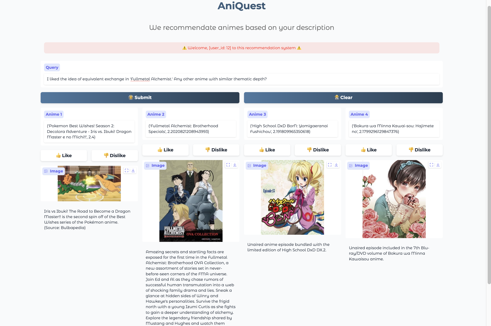

# **Project Setup Instructions**
This guide will help you set up the environment and run the application.

Ensure you have the following installed:
- Python 3.8+
- uv package manager
   If not installed, follow the installation guide at [UV Package Manager Docs](https://github.com/astral-sh/uv).

## Setup Instructions
**Create a Virtual Environment**

Create an isolated environment for the project. Run the following command:

1. Create virtual environment
    ```shell
    $ uv venv
    ```
2. Sync environment
    ```shell
    $ uv sync
    ```
3. Add dependencies
   ```shell
   $ uv add "[package]"
   ```
4. Remove dependencies
   ```shell
   $ uv remove "[package]"
   ```
## Running the Application
Start the application by running:
   ```shell
   $ uv run app.py
   ```
## Dataset
**Location:** The dataset required for this project is located in the data/ directory.
Format: Ensure that all dataset files (e.g., final_anime_list.csv) are properly placed in this folder before running the application.

**Downloading Instructions:** 

Some datasets are too large to include directly in the repository, so we filter out and use smaller versions. You can download the required datasets using the links below:

- [Anime Dataset 2023](https://www.kaggle.com/datasets/dbdmobile/myanimelist-dataset)
- [MyAnimeList Dataset](https://www.kaggle.com/datasets/azathoth42/myanimelist)

## Screenshots

Here are some screenshots of the application:


**Main Dashboard Screen for a New User**


**Main Dashboard Screen for an Existing User**

## Demo Video
Watch the demonstration of the project to understand its workflow and functionality:

<video src="https://github.com/jcai0o0/AniQuest/blob/main/img/AniQuest-demo-video.mp4" width="300" />
If the video does not play inline, you can download it directly [here](img/AniQuest-demo-video.mov).

